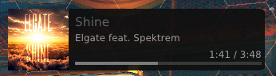
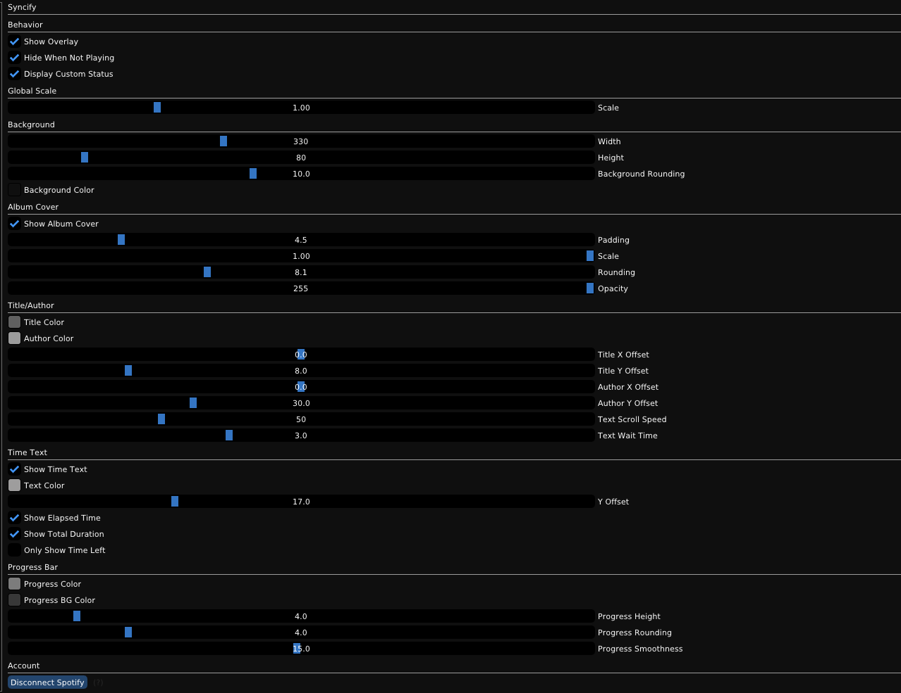

# 🎵 Syncify

A [BakkesMod](https://bakkesmod.com/) plugin that displays the current song you are listening to on Spotify.

---

## ✨ Features

- 🎶 Displays current song title and artist as an overlay in-game!
- ⭐ Displays the current "in-game status" as the song title and artist!

---
## ⭐ Preview

---

## 📦 Installation

1. Open the Plugin-Manager in Plugins tab in BakkesMod
2. Enter the ID: 575
3. Press the button "Install By ID"
4. Enjoy the plugin!

---
## 📦 Setup

1. Head over to [Spotify Developer Portal](https://developer.spotify.com/dashboard)
2. Create a new "App"
3. Fill out the app information as required. Name, Description
4. The redirect URL is -> http://127.0.0.1:5173/callback
5. Which API/SDKs are you planning to use? Select "Web API" and "Web Playback SDK"
6. Agree to the TOS and press Save
7. Copy the ClientId and Client Secret into the text fields in the plugins settings window
8. Press "Authenticate" and your browser will open asking to authorize with Spotify.
9. Press Accept and you are done!

## ⚙ Issues
1. "I don't see the song display" -> Make sure you are in a game (can be any game mode just not in the main menu) and Make sure "Show Display" is enabled in the settings.

## 🛠️ Notes

- Report bugs to my discord (mediacy) or create an issue on github.

---

## 🔗 Credits

- [Mediacy](https://github.com/ImBritish) - Creator ❤️
- [SoulDaMeep](https://github.com/SoulDaMeep) - Current Song as Online Status ❤️
